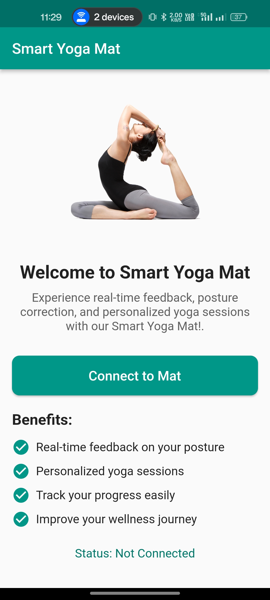
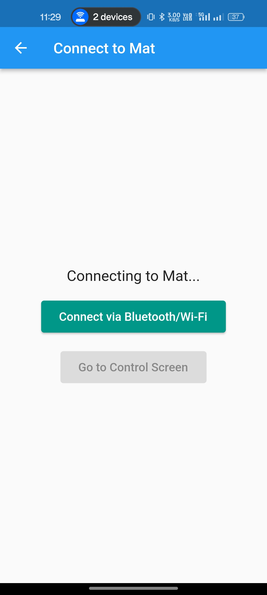
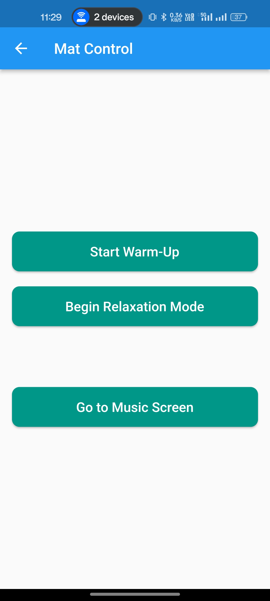
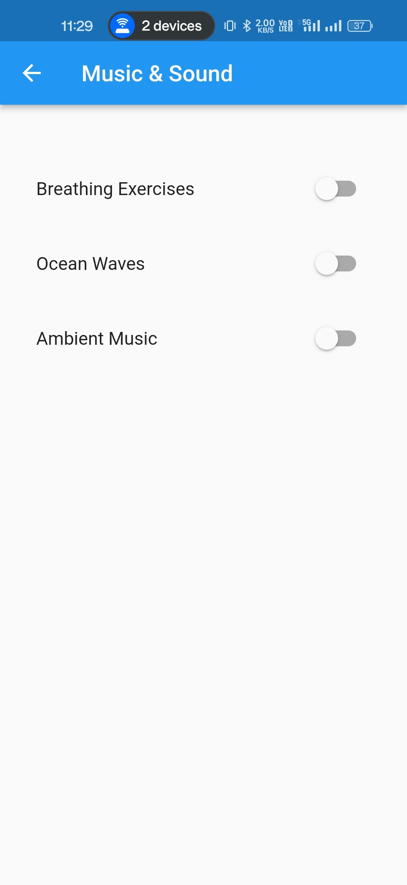

# Smart Yoga Mat App

## App Introduction

The **Smart Yoga Mat App** connects your phone to a smart yoga mat via **Bluetooth** or **Wi-Fi**. The app allows users to control mat functions like **Warm-Up** and **Relaxation Mode**, play relaxing sounds (breathing exercises, ocean waves, ambient music), and update the mat’s firmware via **OTA** updates. Built with **Flutter**, it ensures compatibility across both **iOS** and **Android** platforms.

## Technology Stack

- **Framework**: [Flutter](https://flutter.dev)
- **Backend**: [Firebase](https://firebase.google.com)
- **Database**: [Firebase Firestore](https://firebase.google.com/docs/firestore)
- **Bluetooth/Wi-Fi Connectivity**: Native mobile APIs
- **OTA Updates**: Simulated via Firebase

## Dependencies

- `flutter`
- `firebase_core`
- `firebase_auth`
- `cloud_firestore`
- `audioplayers`
- `flutter_blue`
- `http`

### Install dependencies
```bash
flutter pub get
```

## How to Get Started

### 1. Clone the Repository
```bash
git clone https://github.com/yourusername/smart-yoga-mat-app.git
```

### 2. Install Flutter
Follow the [Flutter installation guide](https://flutter.dev/docs/get-started/install).

### 3. Set Up Firebase
- Create a Firebase project at [Firebase Console](https://console.firebase.google.com/).
- Integrate Firebase for both Android and iOS as per the [FlutterFire setup guide](https://firebase.flutter.dev/docs/overview#installation).

#### Add `google-services.json` File (for Android)
- Download the `google-services.json` file from your Firebase project settings.
- Place the `google-services.json` file in your project under `android/app` directory.

#### Add `GoogleService-Info.plist` File (for iOS)
- Download the `GoogleService-Info.plist` file from your Firebase project settings.
- Open your project in Xcode and add `GoogleService-Info.plist` to the `Runner` directory.

### 4. Install Dependencies
```bash
cd smart-yoga-mat-app
flutter pub get
```

### 5. Run the App
```bash
flutter run
```

## UI Screenshots

Below are some UI screenshots of the **Smart Yoga Mat App**:

1. **Home Screen**  
   The home screen displays an overview of the smart yoga mat, highlighting its features and providing a clear call to action to connect to the mat.
   
   

2. **Device Connection**  
   The connection screen shows the current connection status, allowing users to connect or disconnect from the mat.

   

3. **Control Panel**  
   The control panel lets users start different modes like "Warm-Up" or "Relaxation Mode" with easy-to-use buttons.

   

4. **Music & Sound Options**  
   The sound options screen enables users to toggle between different relaxing sounds for their yoga session.

   

